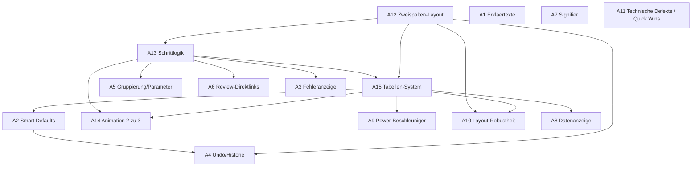

# Implementierungs-Tickets – Wizard-Überarbeitung

Ticketsystem für die Umsetzungsphase. Als Backbone dient der **Anforderungskatalog (A1–A15)** 
Jede Anforderung ist ein Ticket. Feingranulare Einzelbefunde werden nicht als eigene Tickets geführt, sondern innerhalb des jeweiligen Anforderungstickets als abzuhakende Punkte gelistet.

Pfadangaben sind relativ zu `Code/src/app/`. Der Wizard liegt vollständig unter `preprocessing-wizard/`.

Miro-Board (Lösungskonzepte): https://miro.com/app/board/uXjVGrxvTQs=/

**Status-Legende:** `TODO` · `In Progress` · `In Feature-Branch` (fertig entwickelt, in `feature/wizard-redesign` gemergt, noch nicht in `main`) · `Finished` (in `main`)
**Typ:** `Konzept` (durchgeplant in Miro) · `trivial` (kleiner, klar umrissener Fix)

### Branch-Strategie

Integrations-Branch `feature/wizard-redesign` von `main` abzweigen. Pro Ticket ein kurzer Branch davon, dort das Feature bauen, dann per Merge/PR zurück in `feature/wizard-redesign`. Am Ende der ganze Feature-Branch nach `main`.

- Ticket-Branch-Namensschema: `feat/aN-kurzbezeichnung` (z. B. `feat/a4-undo-historie`).
- Ticket-Branches klein halten und zügig zurückmergen, sonst driftet der Feature-Branch weg.
- Regelmäßig `main` in `feature/wizard-redesign` mergen, damit der finale Merge klein bleibt.
- Statusübergang: `TODO` → (Branch anlegen) `In Progress` → (in Feature-Branch gemergt) `In Feature-Branch` → (Feature-Branch in `main`) `Finished`.

---

## Übersicht

| Ticket | Kurztitel | Typ | Status | Branch | Hauptort im Code |
|--------|-----------|-----|--------|--------|------------------|
| A1 | Fachbegriffe/Optionen erklären | Konzept | In Feature-Branch | `feat/a1-a11-erklaerungen-defekte` | `shared/constants/help-text.ts`, `shared/help-tooltip/`, `shared/projection-preview/`, Step 3+4 |
| A2 | Voreinstellungen sichtbar/umkehrbar | Konzept | In Feature-Branch | `feat/a2-smart-defaults` | Step 2+3, `services/preprocessing.service.ts` |
| A3 | Fehlermeldungen inline/verständlich | Konzept | In Feature-Branch | `feat/a3-fehleranzeige` | Step 4+5 |
| A4 | Undo/Zurücksetzen | Konzept | In Feature-Branch | `feat/a4-undo-historie` | `services/preprocessing.service.ts`, Step 1+4 |
| A5 | Zusammengehöriges gruppieren | Konzept | In Feature-Branch | `feat/a5-gruppierung` | Step 3+4 |
| A6 | Review-Navigation (Direktsprünge) | Konzept | In Feature-Branch | `feat/a6-direct-links` | Step 5, `shared/progress-stepper/` |
| A7 | Ehrliche/konsistente Signifier | trivial | In Feature-Branch | `feat/a10-a7-polish` | Step 1/2/4, `shared/progress-stepper/` |
| A8 | Systemstatus/Datenanzeige korrekt | trivial | In Feature-Branch | `feat/a8-datenanzeige` | Step 2+4 |
| A9 | Beschleuniger für Power-Nutzer | Konzept | In Feature-Branch | `feat/a9-power-shortcuts` | Step 2/3/4 |
| A10 | Layout gegen lange/viele Inhalte | Konzept | In Feature-Branch | `feat/a10-a7-polish` | Step 1+4, `shared/_wizard-shared.scss` |
| A11 | Technische Defekte beheben | trivial | In Feature-Branch | `feat/a1-a11-erklaerungen-defekte` | siehe Ticket |
| A12 | Zweispaltiges Layout | Konzept | In Feature-Branch | `feat/a12-two-column` | `preprocessing-wizard.component.*`, `shared/progress-stepper/` |
| A13 | Schrittlogik klären/neu ordnen | Konzept | In Feature-Branch | `feat/a13-schrittlogik` | Step 2/3/4, `shared/constants/step-info.ts` |
| A14 | Übergänge sichtbar (Animation) | Konzept | In Feature-Branch | `feat/a14-animation` | Step 2↔3, `shared/data-preview-table/` |
| A15 | Einheitliches Tabellen/Listen-System | Konzept | In Feature-Branch | `feat/a15-table-system` | `shared/data-preview-table/`, Step 2/3/4 |

**Aktueller Stand (Integrations-Branch `feature/wizard-redesign`):**
- Gemergt (In Feature-Branch): A1–A15 vollständig — alle Tickets sind im Integrations-Branch.
- In Arbeit: keine.
- Offen (TODO): A2-Nachtrag (Smart Defaults erweitern — Hochkardinalität in Schritt 2 + klügerer `colorFeature`-Default; siehe Ticket A2).
- Nächster Schritt: A2-Nachtrag umsetzen; danach `feature/wizard-redesign` nach `main` mergen und alle Tickets auf `Finished` setzen.
- Gebündelt umgesetzt: A7+A10 in `feat/a10-a7-polish`; A1+A11 in `feat/a1-a11-erklaerungen-defekte`.
- Doku: Jedes Ticket hat einen „Umgesetzt"-Abschnitt mit PR-Verweis. Die Abschnitte für A2–A10 und A12–A15 wurden nach dem Merge aus Code und PR-Beschreibungen abgeleitet (A1/A11 direkt aus der Umsetzung).

---

## Umsetzungsreihenfolge und Abhängigkeiten

Die Reihenfolge ist von den Abhängigkeiten getrieben, nicht von der Katalognummer. Grundgedanke: erst das strukturelle Fundament (Layout-Shell, Schrittlogik, gemeinsame Tabelle), dann die Features, die darauf aufsetzen, zuletzt der Feinschliff. Undo (A4) kommt spät, weil es zum einen den Platz im großen Layout braucht und zum anderen den Zustand sichern muss, den erst die Smart Defaults (A2) festlegen.

| Phase | Reihenfolge | Ticket | Blockiert von | Begründung |
|-------|-------------|--------|---------------|------------|
| 1 – Fundament | 1 | A12 Zweispaltiges Layout | — | Die Shell, in der alle Schritte rendern. Muss zuerst stehen. |
| 1 – Fundament | 2 | A13 Schrittlogik/Neuzuschnitt Schritt 4 | A12 | Legt fest, welcher Inhalt in welchem Schritt lebt; spätere Tickets bauen darauf. |
| 1 – Fundament | 3 | A15 Tabellen/Listen-System | A12 (inhaltlich A13) | Gemeinsame Tabellenkomponente, die A2, A8, A9, A14 wiederverwenden. |
| 2 – Features | 4 | A5 Gruppierung/Parameter in Box | A13 | Setzt den Neuzuschnitt von Schritt 4 voraus. |
| 2 – Features | 5 | A2 Smart Defaults sichtbar/umkehrbar | A15 | Braucht die Tabelle, um Auswahl-/Default-Zustand anzuzeigen. |
| 2 – Features | 6 | A14 Übergangsanimation 2↔3 | A15, A13 | Tabelle ist Träger des Morphings; Schrittstruktur muss stehen. |
| 2 – Features | 7 | A9 Power-Beschleuniger | A15 | Shift-Klick, Select-all-gefiltert, Drag-and-drop bauen auf der Tabelle/Liste auf. |
| 2 – Features | 8 | A10 Layout-Robustheit/Feature-Suche | A15, A12 | Durchsuchbare Feature-Liste und Umbruch im neuen Layout. |
| 2 – Features | 9 | A6 Review-Direktlinks | A13 | Sprünge zielen auf die final zugeschnittenen Schritte. |
| 2 – Features | 10 | A8 Datenanzeige („-"→„0", Zeilenkontext) | A15 | Anzeige in der gemeinsamen Tabelle. |
| 3 – Zustand/Inhalt | 11 | A3 Fehleranzeige/Persistent Result | A13 | Step 4/5 müssen strukturell stehen. |
| 3 – Zustand/Inhalt | 12 | A4 Undo/Historie | A12, A2 | Braucht Platz im Layout und ein gesetztes State-/Reset-Modell. |
| 4 – Feinschliff | 13 | A1 Erklärtexte/Tooltips | — (locker) | Inhaltsschicht; sinnvoll, wenn die Komponenten existieren. |
| 4 – Feinschliff | 14 | A7 Signifier | — | Kosmetisch; final nach dem Restyle durch A12/A15. |
| 4 – Feinschliff | 15 | A11 Technische Defekte | teils — | Flaky Tooltip und doppelte „Moderate"-Option sind unabhängige Quick Wins (jederzeit, gern zuerst für Momentum); Persistent-Result-Teil zusammen mit A3. |

Quick Wins ohne Abhängigkeit, die sich parallel zum Fundament wegräumen lassen: A11 (flaky Tooltip, doppelte Option), A7 (Signifier), teils A1 (Erklärtexte).

---

## A1 – Fachbegriffe und Optionen verständlich erklären
**Typ:** Konzept · **Miro:** Visual Tooltips Methoden · **Status:** In Feature-Branch (PR #83 gemergt, gebündelt mit A11) · **Branch:** `feat/a1-a11-erklaerungen-defekte`
**Befunde:** C-S4-01, C-S4-03, C-S4-08, C-S4-10, S-S3-02, S-S3-04, P-S3-04

**Problem:** Fachbegriffe werden ohne Erklärung angeboten (Farbattribut, Projektionsmethoden, FastMap, Ausreißermethoden, Z-Wert-Standardisierung, Smart Defaults).

**Hinweis:** Aus A5 übernommen: Die unerklärten Farbabweichungen bzw. die „Farbauswahl" sind hier über einen erklärenden Text zu lösen, nicht über ein zusätzliches Farb-Steuerelement.

**Wo umsetzen:**
- Erklärtexte zentral pflegen in `shared/constants/help-text.ts`.
- Abrufbare Erklärung (Progressive Disclosure) über die bestehende `shared/help-tooltip/`-Komponente; für Projektionsmethoden auf visuelle Tooltips erweitern (Miro „Visual Tooltips Methoden", vgl. `tmp/Projektion_Methoden_Visualisierung.html`).
- Einbindung an den Optionen selbst: Farbattribut und Projektionen in `steps/step4-visualization-settings/`, Ausreißer-/Standardisierungsoptionen in `steps/step3-configure-data-features/`.

**Umgesetzt (PR #83):**
- Neue Komponente `shared/projection-preview/`: animierte Canvas-Vorschau je Projektionsmethode (aus ClaudeDesign-Vorlage „Projection Previews" portiert; baut/animiert nur die angefragte Methode, läuft nur bei geöffnetem Popup, Tempo 0.5). Eingebunden als Hilfe-Icon mit Vorschau-Popup an jeder Projektionskarte in Step 4 und bei FastMap (Badge „Always active").
- Erklärtexte für Farbattribut (`colorFeature`) und Farbskala (`colorScale`) in Step 4 verdrahtet; Farbskala-Text weist auf den rein kosmetischen Charakter hin.
- Smart-Defaults-Erklärtext (`smartDefaults`) an der Spalten-Konfigurationskarte in Step 3.
- Ausreißer-Prinzipien (IQR vs. Z-Score) und der Strenge-Hinweis kompakt in den Outlier-Tooltip aufgenommen (erklärt zugleich die wiederkehrenden Strenge-Labels, Bezug zu C-S3-04).
- Standardisierung/Z-Wert und Ausreißermethoden waren bereits über bestehende `tableHeaders`-Tooltips erklärt.
- Nicht umgesetzt: keine statische Bild-Grafik nötig — die Erklärung erfolgt über die animierte Live-Vorschau statt über `tmp/Projektion_Methoden_Visualisierung.html`.

---

## A2 – Voreinstellungen sichtbar und umkehrbar machen
**Typ:** Konzept · **Miro:** Smart Defaults Button · **Status:** In Feature-Branch · **Branch:** `feat/a2-a9-defaults-power`
**Befunde:** C-S2-01, C-S3-02, S-S3-01, P-S3-04

**Problem:** Smart Defaults sind unsichtbar; unklar was automatisch gesetzt wurde; geänderte Defaults sind nicht reaktivierbar; in der Spaltenauswahl fehlt eine sinnvolle Vorauswahl.

**Wo umsetzen:**
- Smart-Default-Logik/State in `services/preprocessing.service.ts` (Kennzeichnung „vom Default abweichend", Reset-Funktion).
- Vorauswahl beim Spalten-Import in `steps/step2-column-selection/` (offensichtlich ungeeignete Spalten vorab abwählen; vgl. `missingPercentage > 50 || uniqueCount === 1`).
- Vorauswahl erweitern um Hochkardinalität: Spalten mit (nahezu) 100 % Uniqueness (`uniqueCount === totalRows` bzw. `uniqueCount / totalRows` nahe 1 — typisch IDs, Titel, Namen, Freitext) beim Import automatisch abwählen, sichtbar gekennzeichnet und wie jeder Default umkehrbar. Ergänzt die bestehende Heuristik um den Fall, der bisher erst zur Laufzeit auffällt.
- Sichtbare Kennzeichnung + „Smart Defaults zurücksetzen/erneut anwenden"-Button in `steps/step3-configure-data-features/` und `steps/step4-visualization-settings/`.

**Bezug (aus A3 / Fehlerklasse K7):** In A3 wurde der *reaktive* Teil dieses Problems abgedeckt — der Prozessor bricht bei einer One-Hot-Explosion früh und verständlich ab (`src/assets/preprocessing_processor_config.py`, Schwelle `MAX_ONEHOT_UNIQUE`), und die Fehlerklasse K7 (`shared/constants/wizard-error-classes.ts`) benennt die betroffenen Spalten und schlägt Abwählen bzw. Label-Encoding vor. Konkreter Auslöser war `streaming_titles.csv` mit fünf pro Zeile einzigartigen Spalten (`show_id`, `title`, `director`, `cast`, `description`): One-Hot hätte daraus ~43.750 Spalten erzeugt und den (Pyodide-)Speicher gesprengt. A2 soll denselben Fall *proaktiv* entschärfen — solche Spalten gar nicht erst standardmäßig aktiv lassen, statt den Nutzer erst im Fehlerfall (K7) gegensteuern zu lassen.

**Umgesetzt (PR #78, `feat/a2-a9-defaults-power`):**
- Smart Defaults werden im Service aus `DATA_TYPE_CONFIG` abgeleitet (`getColumnDefaults`, `createDefaultColumnConfig` in `services/preprocessing.service.ts`); das alte „Smart defaults applied"-Banner in Schritt 3 wurde entfernt.
- Abweichungserkennung je Einstellung in `steps/step3-configure-data-features/` (`isEncodingModified`, `isScalingModified`, `isMissingModified`, `isOutlierModified`, Sammel-Flag `isColumnModified`) mit sichtbarer Kennzeichnung.
- Umkehrbarkeit: Reset je Einstellung (`resetEncoding/Scaling/Missing/Outliers`) plus „Reset to defaults" für die ganze Spalte (`resetColumnToDefault`).
- Proaktive Vorauswahl beim Import: `createDefaultColumnConfig` setzt `enabled: !hasIssues` mit `hasIssues = missingPercentage > 50 || uniqueCount === 1`; solche Spalten starten abgewählt und sind in Schritt 2 reaktivierbar (entschärft One-Hot-Explosion proaktiv, Bezug K7).
- Nicht umgesetzt: die zusätzlich geplante Hochkardinalitäts-Heuristik (`uniqueCount ≈ totalRows`, typische IDs/Freitext) fehlt in `hasIssues` — vorab abgewählt werden nur konstante bzw. überwiegend leere Spalten.

**Nachtrag (TODO) — Smart Defaults erweitern · Branch (Vorschlag):** `feat/a2-nachtrag-smart-defaults`
Eigenständiges Folge-Arbeitspaket zu A2 (der Rest von A2 ist gemergt). Umfang „Hoch + Mittel":
- *Hoch — Hochkardinalität in Schritt 2:* Spalten mit nahezu 100 % einzigartigen Werten proaktiv abwählen. Heuristik: `uniqueCount / count >= 0.9` (ggf. 0.95) **und** `count > ~20`, beschränkt auf Text/Categorical/ID (numerische Messwerte ausnehmen). Nutzt vorhandene Felder (`column-statistics.ts`, `getUniquePercent`), kein neues Datenmodell. Umsetzung in `createDefaultColumnConfig` (`services/preprocessing.service.ts:283`) + gespiegelt in `steps/step2-column-selection/` (ts:200) — mit eigenem Grund (`issueDescription`) statt Vermischung in `hasIssues`.
- *Hoch — sichtbare Kennzeichnung:* expliziter „automatisch abgewählt"-Marker in Schritt 2 (getrennt vom Qualitäts-Warnicon) mit Kurzbegründung; Tipp erweitern um den Fall 100 % einzigartiger Werte (IDs/Titel/Freitext) und den Hinweis auf Reaktivierbarkeit.
- *Mittel — klügerer `colorFeature`-Default:* statt willkürlich `columns[0]` (`step4…ts:387-395`) ein niedrig-kardinales Kategoriemerkmal bzw. eine varianzstarke Numeric wählen und als Default sichtbar kennzeichnen.
- *Bewusst außen vor (niedrig):* typabhängige Missing-Imputation (Median/Mean) und aggressivere Ausreißer-Defaults — konservatives `Keep` bleibt.

---

## A3 – Fehlermeldungen inline, verständlich und lösungsorientiert
**Typ:** Konzept · **Miro:** Fehleranzeige, NEU: Persistent Result Screen + Errorhandling · **Status:** In Feature-Branch · **Branch:** `feat/a3-fehleranzeige`
**Befunde:** C-S4-05, C-S5-02, P-S5-01

**Problem:** Fehler erscheinen spät, entfernt vom Ort, inhaltlich nichtssagend, teils nur als flüchtiges Popup.

**Wo umsetzen:**
- Feldnahe Inline-Validierung in `steps/step4-visualization-settings/` (Fehler am jeweiligen Parameter).
- Verständliche, dauerhaft sichtbare Fehlermeldung im Review/Processing: `steps/step5-review-processing/` (Ursache + Lösung, kein verschwindendes Popup).
- Analysegrundlage: `fehlerbehandlung-wizard-analyse.html`, `fehlerklassen-ableitbarkeit.html`.

**Umgesetzt (PR #81, `feat/a3-fehleranzeige`):**
- Neues Fehlerklassen-Modell in `shared/constants/wizard-error-classes.ts` (mit Spec): klassifiziert Worker-Fehler in verständliche, lösungsorientierte Meldungen (u. a. K4, K7).
- Ursachen-Fix in `services/data-processor.ts`: Worker-Fehler werden als echte `Error` (statt String) weitergereicht, damit die Ursache erhalten bleibt; `clearError()` gegen den beim Wiedereinstieg „klebenden" Fehler.
- Persistent Result Screen in `steps/step5-review-processing/` mit fünf Zuständen (Review/Pre-flight, Processing, blockierender Fehler, Partial, Success), „Your work is saved"-Pill und Methoden-Statusleiste; `ngOnInit` stellt Ergebnis/Fehler nach Wiedereinstieg wieder her (deckt P-S5-02/03 mit ab).
- „Fix in Schritt N"-Sprung aus dem Fehlerscreen (über die A6-Sprunglogik) plus Toast.
- Feldnahe Inline-Validierung in `steps/step4-visualization-settings/` (Meldung direkt unter den betroffenen Parametern bei K4; Glyph-Panel flaggt „zu viele" > 12).

---

## A4 – Rückgängigmachen und Zurücksetzen anbieten
**Typ:** Konzept · **Miro:** Historie einführen · **Status:** In Feature-Branch (PR #82 gemergt) · **Branch:** `feat/a4-undo-historie`
**Befunde:** C-S1-02, C-S4-09, P-S3-01
**Tests:** Automatisierte Tests für das Undo/Redo-Feature ergänzt (Testsuite grün).

**Problem:** Folgenschwere Aktionen (erneuter Upload, Smart-Defaults-Klick, gesetzte Filter) sind nicht umkehrbar. Voraussetzung ist eine Aktionshistorie — im Code bisher **nicht vorhanden** (kein `undo`/`history` gefunden).

**Wo umsetzen:**
- Historie/Undo-Stack neu im State: `services/preprocessing.service.ts` (Snapshot der `preprocessing-state`).
- Undo nach „Upload Different File": `steps/step1-upload/`.
- Undo für Smart-Defaults-Reset: `steps/step4-visualization-settings/`.
- Filter leeren: `steps/step3-configure-data-features/`.

---

## A5 – Zusammengehöriges räumlich gruppieren
**Typ:** Konzept · **Miro:** Parameter Location, Aufbereitung Rework · **Status:** In Feature-Branch · **Branch:** `feat/a5-gruppierung`
**Erweiterter Umfang:** die Methodenbox klappt in-place auf (Höhe animiert, Breite konstant) und ist im nicht-aufgeklappten Zustand vollständig geschlossen; Reset je Box. Der Schritt-3-Tabellenteil von A5 wurde bewusst nicht hier, sondern im Zuge von A15 (Schritt-3-Redesign) behandelt.
**Befunde:** C-S3-01, C-S4-07, S-S4-03

**Problem:** Projektionsparameter liegen außerhalb ihres Methodenkastens (willkürlich platziert); Datenkonfiguration überladen, Spaltenzuordnung nicht erkennbar. *(Vom Nutzer als teils trivial markiert: Parameter in die zugehörige Parameterbox verschieben.)*

**Wo umsetzen:**
- Parameter in den Kasten der jeweiligen Methode ziehen + Reset auf Defaultwerte: `steps/step4-visualization-settings/step4-visualization-settings.component.html` und `.ts` (Miro „Parameter Location").
- Datenkonfiguration klarer strukturieren (Angabe↔Spalte erkennbar): `steps/step3-configure-data-features/`.

**Hinweis:** Der Befund zu unerklärten Farbabweichungen bzw. zur „Farbauswahl" passt inhaltlich nicht zu A5 und wird nach A1 verschoben; dort ist er über einen erklärenden Text statt über ein Farb-Steuerelement zu lösen.

**Umgesetzt (PR #74, `feat/a5-gruppierung`):**
- Projektionsparameter liegen jetzt in der jeweiligen Methodenbox in `steps/step4-visualization-settings/` (Aufklapp-Button `btn-expand-params` → `toggleMethodParams`, Zustand `expandedMethodParams`/`isMethodParamsExpanded`).
- In-place-Aufklappen: animierte Höhe bei konstanter Breite über `.params-wrapper`/`.params-clip` (Kollaps auf `0fr`); im geschlossenen Zustand vollständig zu.
- Reset je Box: `resetMethodParams(method)`, Button nur aktiv bei Abweichung (`methodParamsChanged`).
- Der Schritt-3-Tabellenteil wurde wie im Hinweis vermerkt nicht hier, sondern über A15 behandelt.

---

## A6 – Navigation und Bearbeitung im Review-Schritt
**Typ:** Konzept · **Miro:** Direct Links · **Status:** In Feature-Branch · **Branch:** `feat/a6-a8-review-datenanzeige`
**Befunde:** C-S5-01, S-S5-01

**Problem:** Im Review lässt sich nichts direkt bearbeiten; Nutzer müssen sich merken, in welchem Schritt eine Einstellung lag.

**Wo umsetzen:**
- Direktsprünge je Einstellungsblock in `steps/step5-review-processing/step5-review-processing.component.html`.
- Sprung-/Aktivierungslogik in `preprocessing-wizard.component.ts` bzw. `shared/progress-stepper/` (gezielt zu Schritt X wechseln).

**Umgesetzt (PR #79, `feat/a6-a8-review-datenanzeige`):**
- Pro Summary-Card in `steps/step5-review-processing/step5-review-processing.component.html` ein Edit-Icon-Button → `editSetting(step, anchorId)` → `goToStepWithScroll(...)`.
- Scroll-to-Target über `scrollTargetSubject` (BehaviorSubject) in `preprocessing-wizard.component.ts`/`services/preprocessing.service.ts`; der Zielschritt scrollt per `scrollIntoView` zu unsichtbaren `scroll-anchor`-Ankern (additiv, keine URL-Deep-Links).
- Mapping: Columns → Schritt 2; Projection Features / Color / Glyph / Methods → Schritt 4 (jeweiliges Panel).

---

## A7 – Ehrliche und konsistente Signifier
**Typ:** trivial · **Miro:** Änderungen · **Status:** In Feature-Branch · **Branch:** `feat/a10-a7-polish` (gebündelt mit A10)
**Befunde:** C-S1-01, C-S4-02, C-S3-03, S-S2-01

**Problem:** Aktive Navigationsleiste wirkt deaktiviert; Auswahlfeld sieht aus wie Eingabefeld; farbliche Abweichungen unerklärt; „Select All" suggeriert falschen Zustand.

**Wo umsetzen:**
- Navigationsleisten-Farbschema: `shared/progress-stepper/progress-stepper.component.scss`.
- Auswahlfeld-Optik (Select statt Eingabe): `steps/step4-visualization-settings/`.
- „Select All"-Zustand: `steps/step2-column-selection/`.

**Umgesetzt (PR #80, `feat/a10-a7-polish`, gebündelt mit A10):**
- Progress-Stepper: erreichbare/besuchte Schritte erscheinen in Akzent-Cyan statt ausgegraut, nur echte Zukunftsschritte bleiben grau (`shared/progress-stepper/progress-stepper.component.scss` + `.ts`).
- Step 4: COLOR-ATTRIBUTE-Feld als Select mit Chevron gestaltet (nicht mehr wie ein Texteingabefeld), einheitliche Chevrons.
- „Select All" (Step 2): Tri-State (indeterminate/checked) war bereits durch A9 korrekt — verifiziert, keine Änderung nötig.
- C-S3-03 (unerklärte Farbabweichungen) bewusst ausgelassen; laut ROADMAP nach A1 verschoben und dort per Erklärtext behandelt.

---

## A8 – Systemstatus und Datenanzeige korrekt sichtbar machen
**Typ:** trivial · **Miro:** — · **Status:** In Feature-Branch · **Branch:** `feat/a6-a8-review-datenanzeige`
**Befunde:** C-S4-06, C-S2-03

**Problem:** Zeilenanzahl ohne Gesamtkontext; fehlende Werte als „-" statt „0".

**Wo umsetzen:**
- „-"→„0" bei fehlenden Werten: `steps/step2-column-selection/` bzw. `shared/data-preview-table/` (Missing-Spalte).
- Zeilenanzahl im Gesamtkontext anzeigen: `steps/step4-visualization-settings/`.

**Umgesetzt (PR #79, `feat/a6-a8-review-datenanzeige`, gebündelt mit A6):**
- Missing-Count „—" → „0" gezielt nur in der Statistikspalte von `steps/step2-column-selection/`; Rohdatenzellen (`shared/data-preview-table/`) und Distribution-„—" bewusst unverändert.
- Zeilenanzahl im Gesamtkontext: „N rows in dataset" (mit Tausendertrennung) im Projektionspanel von `steps/step4-visualization-settings/` (über das bestehende `getDatasetRowCount()`).

---

## A9 – Beschleuniger für Power-Nutzer
**Typ:** Konzept · **Miro:** Glyph Feature Search Filter · **Status:** In Feature-Branch · **Branch:** `feat/a2-a9-defaults-power`
**Befunde:** P-S2-02, P-S3-02, P-S3-03, P-S4-01

**Problem:** Fehlende Tastenkürzel (Shift-Klick, Strg+F), keine gemeinsame Bearbeitung gleichartiger Spalten, kein „alle auswählen" bei aktivem Filter, keine Drag-and-drop-Reihenfolge der Features.

**Wo umsetzen:**
- Shift-Klick/Mehrfachauswahl + „alle gefilterten auswählen": `steps/step2-column-selection/`, `steps/step3-configure-data-features/`.
- Bulk-Umstellung gleichartiger Spalten: `steps/step3-configure-data-features/`.
- Drag-and-drop-Reihenfolge der Features: `steps/step4-visualization-settings/`.
- Such-/Filterfeld als Navigationshilfe (Miro „Glyph Feature Search Filter").

**Umgesetzt (PR #78, `feat/a2-a9-defaults-power`):**
- Shift-Klick-Range-Select in `steps/step2-column-selection/` (`pendingShift`/`lastCheckedIndex`, über die gefilterte Liste).
- „Alle gefilterten auswählen": Select-All und Tri-State beziehen sich auf `filteredColumns`.
- Bulk-Umstellung gleichartiger Spalten in `steps/step3-configure-data-features/` („Apply to all N <Type> columns" mit Vorschau-Liste und Bestätigung).
- Drag-and-drop-Reihenfolge der Features in `steps/step4-visualization-settings/` (native DnD, `drag_indicator`-Handle; als eine Undo-Aktion).
- Such-/Filterfeld in Schritt 2 und 3 plus Tastenkürzel `/`, das das Suchfeld fokussiert (ignoriert Eingaben in Feldern).

---

## A10 – Layout gegen lange Inhalte und viele Elemente absichern
**Typ:** Konzept · **Miro:** Glyph Feature Search Filter · **Status:** In Feature-Branch · **Branch:** `feat/a10-a7-polish` (gebündelt mit A7)
**Befunde:** P-S1-01, C-S4-11

**Problem:** Lange Namen brechen aus dem Layout; bei vielen Eigenschaften wird die Feature-Navigation unübersichtlich.

**Wo umsetzen:**
- Umbruch/Kürzung mit Tooltip für langen Text: `shared/_wizard-shared.scss`, `steps/step1-upload/`.
- Platzsparende, durchsuchbare Feature-Liste: `steps/step4-visualization-settings/` (gemeinsam mit A9-Suchfeld).

**Umgesetzt (PR #80, `feat/a10-a7-polish`, gebündelt mit A7):**
- Step 1: Dateiname in der Stat-Card kürzt per Ellipsis und zeigt den vollen Namen als `[title]`-Tooltip, bricht nicht mehr aus dem Grid (`steps/step1-upload/`, Truncation-Mixin in `src/styles/_mixins.scss`).
- `[title]`-Tooltips an Header- und Zellnamen der Data-Preview-Tabelle (`shared/data-preview-table/`) sowie an Feature-/Projektions-Spaltennamen in Step 4.
- Die platzsparende, durchsuchbare Feature-Liste (Kern von P-S1-01/C-S4-11) wurde bereits über A15 umgesetzt; der A10-Restumfang war entsprechend klein.

---

## A11 – Technische Defekte beheben
**Typ:** trivial · **Miro:** Visual Tooltips Methoden, NEU: Persistent Result Screen + Errorhandling · **Status:** In Feature-Branch (PR #83 gemergt, gebündelt mit A1) · **Branch:** `feat/a1-a11-erklaerungen-defekte`
**Befunde:** C-S3-04, C-S4-04, S-S4-02, P-S5-02, P-S5-03

**Problem/Wo je Defekt:**
- **C-S4-04** Tooltip verschwindet beim Inspizieren (Flaky) → `shared/help-tooltip/help-tooltip.component.ts` (Hover-/Z-Index-Verhalten). *Vom Nutzer als trivial markiert.*
- **S-S3-03** verwandt (Tooltip auf falscher Z-Ebene) → gleiche Komponente / `steps/step3-configure-data-features/`.
- **C-S3-04** Option „Moderate" doppelt → `steps/step3-configure-data-features/` (Optionsliste).
- **S-S4-02** Schritt-Navigation springt nicht zurück zu Schritt 4 → `shared/progress-stepper/` bzw. `preprocessing-wizard.component.ts`.
- **P-S5-02 / P-S5-03** Zusammenfassung verschwindet beim Schließen während der Projektion / nichtssagender Screen nach Wiedereinstieg → `steps/step5-review-processing/` (Miro „Persistent Result Screen + Errorhandling"). → *Bereits im Zuge von A3 (Persistent Result Screen) abgedeckt und gemergt.*

**Umgesetzt (PR #83):**
- **C-S4-04** Grace-Period im `shared/help-tooltip/` (und im neuen Projektions-Popup): Der Tooltip bleibt beim Hineinfahren offen (~180 ms Verzögerung), damit Inhalt/Vorschau überhaupt lesbar sind.
- **C-S3-04** Statt bloßem Umbenennen eine Erklärung der zwei Prinzipien (IQR vs. Z-Score) im Outlier-Tooltip; damit werden die wiederkehrenden Strenge-Labels („Moderate"/„Relaxed") verständlich.
- Fokus-Zustand korrigiert: Hilfe-/Vorschau-Icon bleibt nach Klick nicht dauerhaft blau (Farbe nur bei Hover / `:focus-visible`).
- Tooltip-Platzierung in Step 3 gefixt: `gsap.from()` (A14-Morph) hinterließ ein inline `transform` auf `.detail-well`, wodurch `position:fixed`-Tooltips relativ zur Welle statt zum Viewport rechneten; `clearProps: 'transform'` entfernt es nach der Animation.
- Keine horizontale Scrollbar mehr: Tooltips bis zur Positionsberechnung außerhalb des Sichtfelds geparkt, Clamping an `clientWidth/Height`; `.detail-well` `overflow-x: hidden`; `.detail-card` wächst mit dem Inhalt (kein Abschneiden).
- Bereits vorher behoben/abgedeckt (verifiziert, keine Änderung nötig): **S-S3-03** (Tooltip-Z-Ebene, `position:fixed` + hoher z-index), **S-S4-02** (Rücksprung zu Step 4 über den Stepper), **P-S5-02/03** (über A3).

---

## A12 – Anzeigeraum effizient und zweispaltig nutzen
**Typ:** Konzept · **Miro:** Neue two column UI, Neuer Schritt 4 Anpassung · **Status:** In Feature-Branch · **Branch:** `feat/a12-two-column`
**Befund:** K-01

**Problem:** Vertikaler Bildschirmraum schlecht genutzt; Navigation über volle Breite erzeugt langes Scrollen.

**Wo umsetzen:**
- Grundlayout (Navigation links, Arbeitsbereich rechts): `preprocessing-wizard.component.html` + `.scss`.
- Schritt-Navigation an den linken Rand: `shared/progress-stepper/`.

**Umgesetzt (PR #72, `feat/a12-two-column`):**
- Zweispaltiges Grundlayout in `preprocessing-wizard.component.html`/`.scss`: linke `wizard-sidebar` mit `app-progress-stepper` (Schritt-Navigation am linken Rand), rechts der Arbeitsbereich.
- Navigationsleiste `.wizard-nav` in den rechten Arbeitsbereich integriert (nicht mehr über die volle Breite).
- Redundante Schritt-Header aus den Steps entfernt; die Purpose-/Beschreibungstexte in die Sidebar verlagert.
- Nutzt weiterhin die bestehende `shared/progress-stepper/`-Komponente (kein Neubau).

---

## A13 – Schrittlogik klären und neu ordnen
**Typ:** Konzept · **Miro:** Aufbereitung Rework, Neuer Schritt 4 Anpassung · **Status:** In Feature-Branch · **Branch:** `feat/a13-schrittlogik`
**Befund:** K-02

**Problem:** Aufgabe der Schritte 2/3/4 und Bedeutung der jeweiligen Spaltenauswahl konzeptionell nicht getrennt.

**Wo umsetzen:**
- Schrittbeschreibungen/mentales Modell: `shared/constants/step-info.ts`.
- Neuzuschnitt Schritt 4 (Spaltenauswahl neben Projektionsmethode): `steps/step4-visualization-settings/`.
- Abgrenzung Schritt 2 (betrachtete Spalten) vs. Schritt 3 (in Dimensionsreduktion): `steps/step2-column-selection/`, `steps/step3-configure-data-features/`.

**Umgesetzt (PR #73, `feat/a13-schrittlogik`):**
- Auswahl „welche Spalten fließen in die Projektion" aus Schritt 3 entfernt; Schritt 3 ist jetzt reine Datenkonfiguration (keine „Include in projection"-Checkboxen/-Zähler mehr).
- Neue Section „Projection Options" in `steps/step4-visualization-settings/` zweispaltig: links Panel „Projection Columns" (Checkbox-Liste je aktiver Spalte, Typ-Badge, Zähler „x / n included", Select-all/Clear, Suche), rechts das bestehende Methoden-Grid.
- Schrittbeschreibungen in `shared/constants/step-info.ts` geschärft (Schritt 2 = betrachtete Spalten, Schritt 3 = Datenkonfiguration, Schritt 4 = Projektion: Spalten + Methode).
- Validierung in Schritt 4: mindestens eine Projektionsspalte erforderlich (sonst Warnung + Weiter deaktiviert); `includeInProjection` lag bereits im Service (keine Datenfluss-/Modelländerung).

---

## A14 – Übergänge zwischen den Schritten sichtbar machen
**Typ:** Konzept · **Miro:** Animation · **Status:** In Feature-Branch · **Branch:** `feat/a14-animation`
**Befund:** K-03

**Problem:** Zusammenhang der Tabellen von Schritt 2 und 3 nicht sichtbar; unklar, wie die Auswahl übernommen wird.

**Wo umsetzen:**
- Morphing-/Übergangsanimation Schritt 2↔3 (beidseitig): Übergang in `preprocessing-wizard.component.ts` orchestrieren, gemeinsame Tabellenkomponente `shared/data-preview-table/` als Träger der Animation.

**Umgesetzt (PR #77, `feat/a14-animation`):**
- Morph-Übergang Schritt 2 → 3 in `preprocessing-wizard.component.ts` mit GSAP-Timelines orchestriert (globaler Speed-Faktor `MORPH_TIMESCALE`).
- Zwei Phasen: Phase 1 kollabiert die live Step-2-Tabelle per Transform-Overlay auf Rail-Breite (kein Layout-Ruckeln), dann Component-Swap; Phase 2 fährt Rail-Header (`yPercent`) und Detail-/Konfig-Well (`xPercent`) von außen herein.
- `prefers-reduced-motion: reduce` schaltet den Morph ab (sofortiger Wechsel).
- Einschränkung ggü. Ticket: nur der Vorwärts-Morph 2 → 3 ist animiert, nicht bidirektional (2↔3).

---

## A15 – Einheitliches Tabellen- und Listen-Designsystem
**Typ:** Konzept · **Miro:** Tabellen/Listen · **Status:** In Feature-Branch · **Branch:** `feat/a15-table-system`
**Erweiterter Umfang:** zusätzlich Schritt-3-Redesign (Option 1d: Master-Rail + eingelassenes Konfigurations-Well mit Breadcrumb und Fehlwert-Badges) sowie Überarbeitung der Schritt-4-Feature-Liste (funktionale Suche/Typ-Filter, Drag-and-drop-Reihenfolge, Drop-in aus der Available-Liste, Höhenlimit mit Scroll) — Letzteres überschneidet sich mit A9.
**Befund:** K-04

**Problem:** Wiederkehrende Tabellen/Listen (Spaltenauswahl, Datenkonfiguration, Feature-Auswahl) sind funktional gleich, aber uneinheitlich gestaltet.

**Wo umsetzen:**
- Gemeinsames Muster in `shared/data-preview-table/` konsolidieren (Auswahl links, Umschalter „alle", Suchfeld, keine Typ-Farbcodierung, einheitliche blaue Akzentfarbe).
- Anwendung in `steps/step2-column-selection/`, `steps/step3-configure-data-features/`, `steps/step4-visualization-settings/`.
- Gemeinsame Styles: `shared/_wizard-shared.scss`.

**Umgesetzt (PR #75, `feat/a15-table-system`):**
- Gemeinsames Auswahl-Designsystem als geteilte Mixins in `shared/_wizard-shared.scss`, angewendet in Step 2/3/4: Auswahl-Checkbox links, Tri-State-„Select all" im Kopf (kein Extra-Button/Doppelzähler), Suchfeld, keine Typ-Farbcodierung der Zeilen; einheitliche Checkbox-Geometrie auf gemeinsamer vertikaler Linie.
- Einheitlicher Akzent aus `_variables.scss` statt neuem Token: `$active-color` (#00bcd4) für Auswahl/Aktiv, `$status-info` (#00838f) für den Auswahl-Zähler „N of M selected".
- Schritt-3-Redesign (Option 1d): Master-Rail links + eingelassenes Konfig-Well mit Breadcrumb; Duplikat-Vorschau nutzt die gemeinsame Tabellenkomponente.
- Schritt-4-Feature-Liste überarbeitet (Überschneidung mit A9): funktionale Suche/Typ-Filter, Drag-and-drop-Reihenfolge, Drop-in aus der Available-Liste, Höhenlimit mit Scroll, Reihenfolge-Badges in Cyan.
- Bewusst offengelassen: `data-type-badge`-Farben bleiben; die exakte Rot/Amber-Abstufung der Fehlwert-Badges wurde nicht nachgebaut.

---

*Ausblick (nicht im Umsetzungsrahmen): methodenspezifische Standardwerte je Projektionsmethode — laut Anforderungskatalog bewusst außerhalb des Rahmens.*
